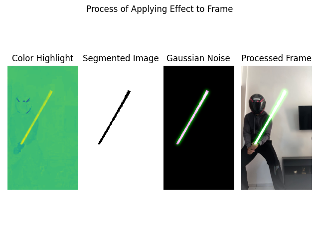

# Create Lightsaber in Video




> O projeto tem como objetivo iterar sobre os frames de um vídeo criando, numa região preconfigurada, o efeito sabre de luz.

## 💻 Pré-requisitos

Antes de começar, verifique se você atendeu aos seguintes requisitos:

<!---Estes são apenas requisitos de exemplo. Adicionar, duplicar ou remover conforme necessário--->

- [`< Python 3 >`](https://www.python.org/)

## 🚀 Baixando e Configurando Projeto

> O código está preconfigurado para ler o arquivo "./Original.mp4" e escrever o arquivo "./LightsaberVideo.mp4"

Para instalar o projeto, siga estas etapas:

```
git clone https://github.com/pumba-dev/create-lightsaber-in-video.git
```

## ☕ Usando o Projeto

> No código você pode alterar a constante LIGHTSABERCOLOR para definir a cor do bastão que você está manipulando.

Para executar o projeto, siga estas etapas:

```
cd create-lightsaber-in-video

.\virtual-env\Scripts\activate

py create-lightsaber-in-video
```

## 🤝 Colaboradores

Agradecemos às seguintes pessoas que contribuíram para este projeto:

<table>
  <tr>
    <td align="center">
      <a href="https://github.com/pumba-dev">
        <br>
        <sub>
          <b>Eu Mesmo</b>
        </sub>
      </a>
    </td>
  </tr>
</table>

## 😄 Seja um dos Contribuidores<br>

Entre em contato para se tornar um contribuidor.

## 💰 Donate

[](https://picpay.me/pumbadev)

## 📝 Licença

Copyright © 2022 Pumba Developer

[⬆ Voltar ao topo](#create-lightsaber-in-video)<br>
